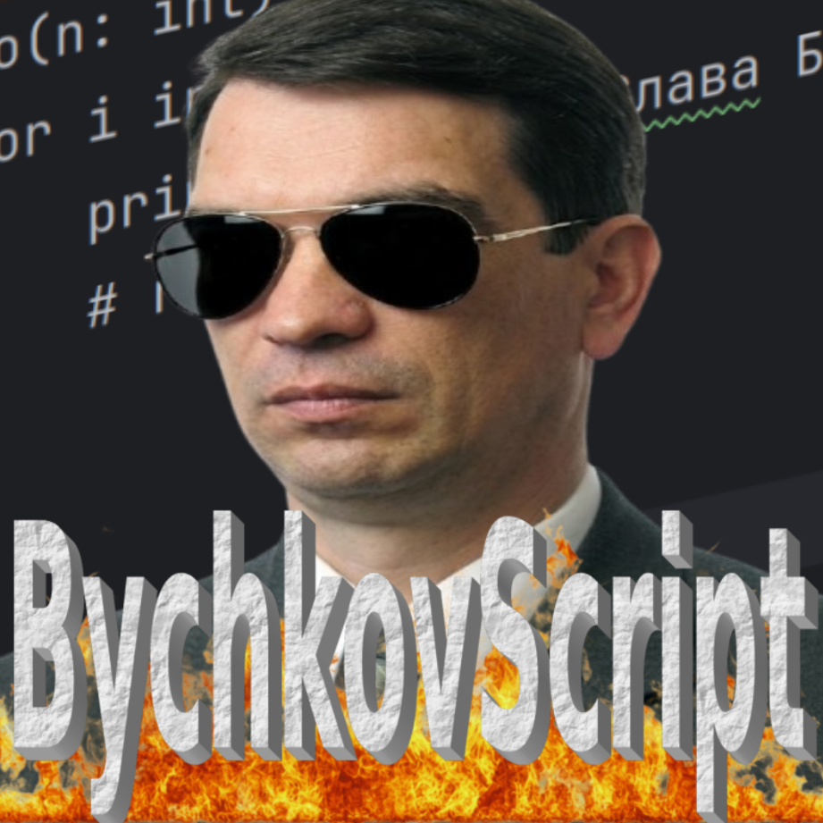

<h1 align="center">BychkovScript</h1>
<p align="center">Перша скриптова мова в честь вельмишановного Бичкова Олексія Сергійовича</p>

___
<p align="center">
  
</p>

<p align="center">
  
  
  
</p>

*!Educational project! проект створений для вивчення принципів роботи компіляторів під капотом, практики з лексичним аналізом та алгоритмами парсингу*

___
## Філософія
BychkovScript створювався як ультимативний інструмент, увібравший в себе "найкращі" практики індустрії та елементи "НАЙКРАЩИХ" мов

- **JavaScript**: 
  - Трушний ублюдський синтаксис порівняння (`===` та `!==`),
  - крапки з комами можна взагалі не ставити, парсеру на них все одно насрати.
  - Не дивлячись на строгу типизацію, присутня колекція `Trashcan` (смітник), у яку можна взагалі напхати все що завгодно
- **Python**:
  - Повільний (дуже)
  - Купа синтаксичного цукру і голої англійскьої мови
  - Тип повертаємого значення вказується після оголошення функції через `->`
- **Інше**
  - Ніякої підтримки
  - Всраті повідомлення при ексепшенах
  - Стандартна бібліотека з двома неповноцінними модулями 
  - Повністю відсутнє ООП (та і воно вам не треба) 
  
### Переваги
В глибині душі BychkovScript прагне бути улюбленцем Бичкова, прямо як Rust

- **Строга типізація**: Ніякого додавання числа до рядка. Якщо типи не збігаються, інтерпретатор видасть вам `JavaScriptFlashbackError` і відмовиться це виконувати
- **Імутабельність**: Оголосили `const`? Навіть не намагайтеся її змінити
- **Ніякого `undefined`**: Якщо змінної немає в скоупі, програма падає. Ми не терпимо непередбачуваності.
___
## Інсталяція

### Linux

- Завантажте архів `linux-x64.tar.xz` з релізу `BychkovScript 1.0.0`
- Розархівуйте його
- Відкрийте термінал у папці `out-linux-x64` та введіть 
```aiignore
sudo bash install.sh
``` 

### Windows

- Завантажте `BychkovScript_Installer_Win64.exe` з релізу `BychkovScript 1.0.0`
- Запустіть його
___
## Як використовувати

- Створіть файл з розширенням `.bs`
- Напишіть там код
```aiignore
fn foo(n: int) -> void {
    for i in 0..n {
        println!(i + ". Cлава Бичкову!");
        # return;
    }
}

foo(3);
```
- Відкрийте термінал біля скрипту та введіть
```aiignore
bs run ваш-скрипт.bs
```
___
## Документація
- [Основи синтаксису](docs/syntax.md)
- [Типи даних](docs/types.md)
___
